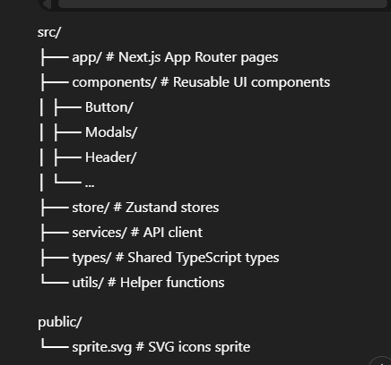

# 🖥️ Meeting Booking Frontend

Frontend application for a meeting booking system where **clients** can book appointments with **business users**.

This project is built as part of a **full-stack test assignment** and demonstrates a real-world frontend architecture with reusable components, predictable state management, and integration with a REST API backend.

---

## 📌 Overview

The goal of this project is to build a user-friendly frontend for managing meeting bookings between clients and business users.  
The application focuses on clean UI architecture, separation of concerns, accessibility, and smooth user experience.

---

## 🚀 Live Demo

👉 https://meeting-booking-frontend.vercel.app/

---

## 🚀 Tech Stack

- **Next.js** (App Router)
- **React**
- **TypeScript**
- **CSS Modules**
- **Zustand** (state management)
- **Formik** (forms handling)
- **SVG Sprite** (icons)
- **Fetch API** (HTTP requests)

---

## 👥 User Roles

### Client

- Can view available business users
- Can create bookings
- Can view, edit, cancel, and delete own bookings

### Business

- Appears in the list of available businesses
- Can view bookings created by clients
- Can manage incoming bookings

---

## 🔑 Core Features

### UI & Architecture

- Modular and reusable component architecture
- Clear separation of concerns:
  - pages (routing)
  - components (UI)
  - stores (state)
  - services (API)
- Scoped styling using CSS Modules

### Booking Management

- Create a booking for a business user
- Edit (reschedule) an existing booking
- Cancel active bookings
- Permanently delete bookings
- Display bookings based on user role
- Sync UI state with backend after each action

### State Management

- Global state managed with **Zustand**
- Dedicated booking store
- Centralized loading and error handling
- No prop drilling

### Forms

- Forms implemented using **Formik**
- Reusable date and time dropdown components
- Input validation before submitting requests
- Shared form logic for create and edit booking flows

### Modal System

- Universal **Modal component** built with **React Portal**
- Features:
  - ESC key support
  - Backdrop click to close
  - Body scroll locking
  - Accessible ARIA attributes
- Reused across booking creation, editing, and confirmations
- Close button implemented via SVG sprite

### UI / UX

- Clean and minimal interface
- Reusable button variants (primary, secondary, icon)
- SVG sprite-based icons
- Responsive layout for desktop and mobile
- Clear visual feedback for loading and disabled states

---

## 🔗 API Integration

The frontend integrates with a custom REST API backend.

- Centralized API communication via `apiClient`
- Async requests with error handling
- UI behavior aligned with backend business logic

### Backend Repository

👉 https://github.com/Tetiana-Onofriichuk/meeting-booking-backend

---

## 📁 Project Structure

<p align="center">
  
</p>

---

## ▶️ Getting Started

```bash
npm install
npm run dev
http://localhost:3000

```

## ♿ Accessibility

- Keyboard navigation support
- ESC key handling in modals
- Semantic HTML
- ARIA attributes for modals and icon-only buttons

---

## 🛠️ Future Improvements

- Authentication & protected routes
- Calendar-based booking view
- Improved mobile UX
- Loading skeletons
- Error boundaries

---

## 👩‍💻 Author

**Tetiana Onofriichuk**  
GitHub: https://github.com/Tetiana-Onofriichuk
